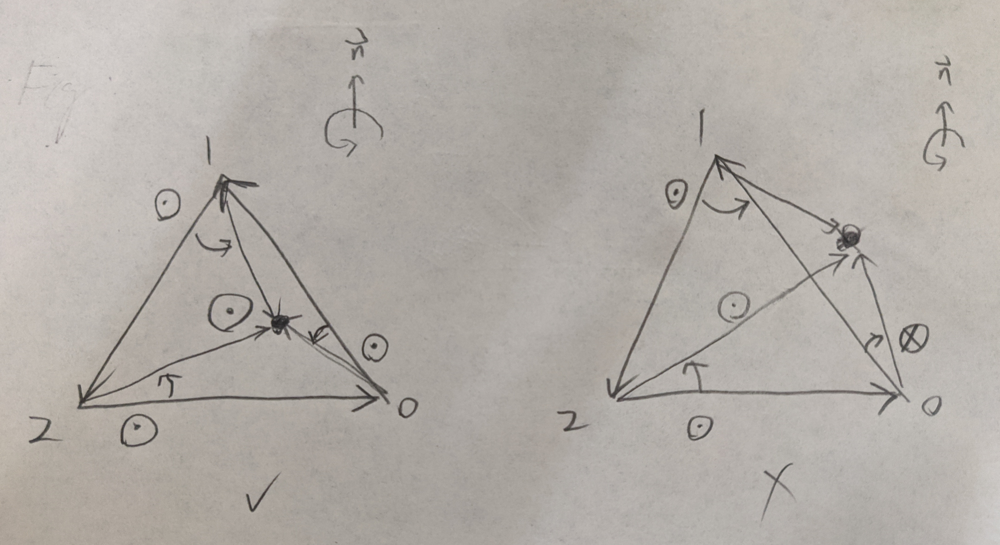
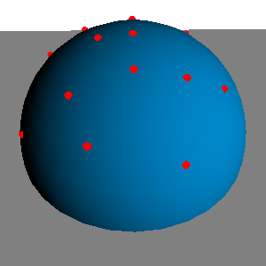
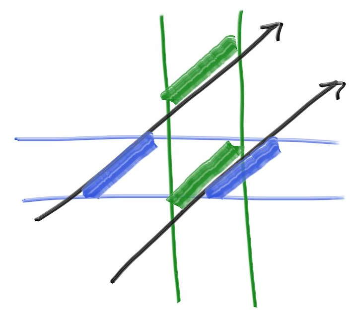
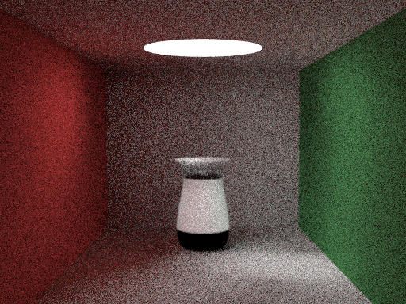

# 计算机图形学 光线追踪实作

# 1. 代码框架与使用方法

## 1.1 框架

在PA1的基础上改进实现，以下仅列出修改较大或新增的源文件：

- **path_tracing.hpp / .cpp**：光线追踪（使用path tracing）实现算法；
- **material.hpp**：依照渲染模型需求修改，用于描述物体表面材质（material）；
- **scene_parser.hpp / .cpp**：读入场景设置文件，依照material与camera的更动修改；
- **camera.hpp**：视点相机，生成从视点出发的射线（Ray)；
- **mesh.hpp / .cpp**：包含PA1的mesh类，以及新增了包围盒与k-d tree的功能（求交加速）；
- **curve.hpp**：二维Bézier曲线；
- **revsurface.hpp**：由二维Bézier曲线绕与y轴平行直线的旋转体；
- **CMakeLists.txt**：CMake参数，加入了OpenMP。

## 1.2 环境

Ubuntu 18.04 LTS / CMake 3.10.2 / Intel core i7-8550u

## 1.3 使用方法

使用方法与PA1相同，在根目录下运行 `bash ./run_all.sh` 即可使用。如果需要自定义场景，可以在目录 `code/testcases/`  下加入自定义场景文件，并且修改 `run_all.sh` 。


# 2. 光线追踪实现与细节

## 2.1 光线与物体求交

`Object` 及其子类：`intersect(const Ray &r, Hit &h, float tmin)` ，其中 `r` 为光线、`h`为碰撞记录（包含距离 `t`、法向量与material)、`tmin` 为 `t`的最小值（若碰撞计算后的 `t`<`tmin` ，则不碰撞）。

### 2.1.1 球体求交

`Sphere::intersection` 

参考：http://viclw17.github.io/2018/07/16/raytracing-ray-sphere-intersection/

球体的方程可以表达为 ${(\vec p-\vec c)}^2=r^2$ ，射线方程可以表达为 $\vec p=\vec o+t\vec d$ ，带入可得 ${(\vec o+t\vec d-\vec c)}^2=r^2$，整理得到 $t$ 的一元二次方程：
$$
(\vec d \cdot \vec d)t^2 + 2\vec d \cdot (\vec o-\vec c)t + {(\vec o-\vec c)}^2 - r^2 = 0
$$
对于求得的解 $t_1, t_2$ 需要取较小且大于 `tmin` 者。

法向量可以由 $(\vec o+t\vec d)-\vec c$ 求得。

### 2.1.2 无穷平面求交

`Plane::intersection` 

参考：https://math.stackexchange.com/questions/1979876/ray-casting-algorithm-in-ray-triangle-intersection

无穷平面可以表示为 $\vec p \cdot \vec n = d$ ，射线方程 $\vec p=\vec o+t\vec d$ ，带入得到
$$
t = {{d - \vec o \cdot \vec n} \over {\vec d \cdot \vec n}}
$$
法向量为 $\vec n$ 。

### 2.1.3 三角片面求交

`Triangle::intersection`

参考：https://www.scratchapixel.com/lessons/3d-basic-rendering/ray-tracing-rendering-a-triangle/ray-triangle-intersection-geometric-solution

首先计算光线是否与三角片面所在平面相交。若是，则继续检查碰撞点是否在三角形内如下图所示，利用三角形边的向量与交点-顶点向量求叉积，再利用点积检查是否与法向量同向，即可判断是否在三角片面内。



### 2.1.4 Bézier旋转体求交

`RevSurface::intersection`

参考使用 计64 翁家翌学长的方法：https://github.com/Trinkle23897/Computational-Graphics-THU-2018/blob/master/hw2/report.pdf


## 2.2 渲染模型

### 2.2.1 Material 描述

为了适当描述物体材质使得参数调整更加方便，`Material` 的参数更动如下：

- `Vector3f diffuseColor`：表面漫射RGB颜色，范围 [0, 1]；
- `float diffuse`：光线射到表面时，漫射的比例，范围 [0, 1]；
- `Vector3f specularColor`：表面反射RGB颜色，范围 [0, 1]；
- `float specular`：光线射到表面时，反射的比例，范围 [0, 1]；
- `Vector3f refractColor`：出射折射RGB颜色，范围 [0, 1]（注意入射时不套用）；
- `float refractiveIndex`：折射率，范围 (0, +$\infin$)；
- `float refract`：光线入射到表面时，入射折射的比例，范围 [0, 1]；
- `Vector3f emission`：物体表面的RGB发光，范围 (0, +$\infin$) 。

需要特别注意：

- `diffuse`+`specular`+`refract`必须 $\leq 1$，确保光的能量守恒。
- 最终输出的图片像素会经过伽玛校正：$V_{out}=int(255.999\times{V_{in}^{1/2.2}})$，其中 $V_{in} \in [0,1]$ 。设置场景时需要考虑逆伽玛校正。

### 2.2.2 漫射

`PathTracing::randomDiffuse`

参考：https://www.cs.princeton.edu/courses/archive/fall16/cos526/papers/importance.pdf

漫射采用 Lambertian Reflectance ，有BRDF：
$$
BRDF_d(P, \theta_i, \theta_o) = {k_d \over \pi}
$$
其中，$k_d$ 为漫射光强，即 `diffuse`*`diffuseColor` ；$P$ 为碰撞点； $\theta_i$ 为入射光与法向量夹角； $\theta_o$ 为出射光与法向量夹角。

**使用蒙特卡洛方法计算漫射光**。

对于碰撞平面的半球上进行抽样，Importance Sampling 考虑入射角较小的光线贡献较大，

使用 Cosinus Mapping ：
$$
\theta = \arccos(\sqrt{1-r_1}) \\
\phi = 2 \pi r_2 \\
r_1, r_2 \sim {\rm Uniform \space Distribution}[0,1]
$$


蒙特卡洛方法下的概率分布函数：
$$
pdf_d(\theta_i)={\cos(\theta_i) \over \pi}
$$
由蒙特卡罗积分计算的渲染方程：
$$
L_d(P)=\int_{\Omega_N}L(\theta_i)\space BRDF_d(P, \theta_i,\theta_o)\space cos(\theta_i) \space {\rm d} \theta \\
=⟨F_d^N⟩={1\over n} \sum_{i=0}^{n-1} {{L(\theta_i)\space BRDF_d(P, \theta_i,\theta_o)\space cos(\theta_i)} \over {pdf_d(\theta_i)}} \\
=L(\theta_i)\space {1\over n} \sum_{i=0}^{n-1} {{BRDF_d(P, \theta_i,\theta_o)\space cos(\theta_i)} \over {pdf_d(\theta_i)}}
=L(\theta_i)\space {1\over n} \sum_{i=0}^{n-1}{k_d}
\tag{1}
$$
化为一个简单的算式，其中 $L(\theta_i)$ 为入射光。如此一来，我们可以用抽样的方法计算一个点的漫射光。

### 2.2.3 反射

`PathTracing::perfectReflect`

反射光计算原先是打算用 Phong Reflectance Model 制造雾面镜面效果，但是随机采样时有可能使入射光线从表面内射出（与法向量夹角大于$\pi\over2$），造成球体边缘因为入射光在接近入射角=$\pi\over2$抽样，从表面内射出的概率提高,返回空值，最终边缘发黑。因此放弃使用。

全部采用完全反射。反射光线方向的计算式：
$$
\vec v_{out} = \vec v_{in} - 2\vec n(\vec v_{in} \cdot \vec n)
$$
不需要使用蒙特卡洛方法抽样，并且反射中没有光能损失，因此反射光有：
$$
L_s(P) = k_s \space L(\theta_i)
$$
其中，$k_s$ 为反射光强，即 `specular`*`dspecularColor` ；$P$ 为碰撞点； $\theta_i$ 为入射光与法向量夹角。

### 2.2.4 折射与全反射

`PathTracing::perfectRefract`

参考：http://graphics.stanford.edu/courses/cs148-10-summer/docs/2006--degreve--reflection_refraction.pdf

同样使用不抽样的完全折射与完全全反射，基本原理利用斯涅尔定律，检查折射/全反射，再给出折射/全反射光线方向。同反射没有能量损失。

当由物体内部出射时，需要套用折射光线强度的参数，方程如下：
$$
L_r(P) = k_r \space L(\theta_i)
$$
当由物体外部入射时，不需要套用折射光线强度的参数，方程如下：
$$
L_r(P) = L(\theta_i)
$$
（实际上只要在入射出射时择一套用即可）（这里不考虑 Fresnel 效应）


## 2.3 渲染算法 - Path Tracing

`PathTracing`

渲染方法采用蒙特卡洛方法的 Path Tracing，一种 Ray Tracing 的实现方法。

算法的核心思路为，对于每个像素点，从视点发出视线，在场景内与物体相交后，计算该碰撞点所受来自各个方向的光线在与表面交互后所该返回视线方向的光线。光线数值的计算通常会在场景内碰撞多次，递归的计算。最终向沿着视线返回像素数值。

直接一个碰撞点所受的所有光线显然是不可能的，因此我么可以采用基于统计的蒙特卡洛方法近似的估计。

主要参考：[smallpt](http://www.kevinbeason.com/smallpt/)

### 2.3.1 基本流程

`PathTracing::Render`

流程如下：

1. 遍历所有像素点，对于每个像素：
   1. 进行多次的采样，每次采样都在该像素内随机的取一个位置发出视线：
      1. 计算采样
   2. 平均所有采样结果；
   3. 写入像素。

### 2.3.2 采样方法

`PathTracing::radiance`

这里使用的采样并不是对于每个碰撞都递归的统计碰撞点的入射光线，而是每次采样都仅有一条光线在物体间弹射，要漫射、反射或折射/全反射由概率决定，每次碰撞可以是作为采样一次的蒙特卡洛方法。避免递归造成的指数增加使得爆栈。

1. 若碰撞深度超过上限，则退出；结束。
2. 检查光线是否与场景物体相交
   1. 否：
      1. 若是为相机直接发出的射线，则返回背景；结束。
      2. 其他，返回零；结束。
   2. 是，依照相交物体的material的漫射/反射/折射比例，随机的决定入射要采样漫射/反射/折射/光线被吸收：
      1. 漫射：递归采样入射光，并带入漫射的渲染模型，加上发光，返回；结束。
      2. 反射：递归采样入射光，并带入反射的渲染模型，加上发光，返回；结束。
      3. 折射：判断应该折射或是全反射：
         1. 折射：递归采样入射光，并带入折射的渲染模型，返回；结束。
         2. 全反射：递归采样入射光，并带入反射的渲染模型，返回；结束。
      4. 光线被吸收：返回发光；结束。

详细见： [path_tracing.hpp](code/include/path_tracing.hpp) ,  [path_tracing.cpp](code/src/path_tracing.cpp) 


## 2.4 渲染特效

### 2.4.1 景深

`PerspectiveCamera`

参考：https://raytracing.github.io/books/RayTracingInOneWeekend.html#defocusblur

景深（Depth of View, dov）实现方法是模拟真实相机有关光圈与焦距的光学特性。

在`PerspectiveCamera`中新增光圈半径`halfAperture`以及焦距`focus`两个参数。生成相机光线时，在直径为光圈的圆盘平面上随机生成一个点`PerspectiveCamera::randomPointAtAperture`，并以此给相机光线的视点（出发点）一个微小的偏移（在光圈之内）得到新的视点。之后将相机光线方向乘上焦距得到这条光线在焦平面（这里不考虑圆弧形的聚焦面）上的点，新视点到这个点的方向就是新的相机光线方向。

如此一来当采样时，在焦平面上采样的交点的距离偏移会非常小；离焦平面越远的偏移越大，因此较为模糊。如此形成景深效果。

### 2.4.2 柔阴影

`PathTracing::Render`

使用 Path Tracing 算法，在处理发光物体相对于 Point Light 或 Directional Light 较好（本作业可以使用全局光源，但效果很差，`PathTracing::enableGlobalLighting`）。场景中舍去使用`Light`类的光源，改在场景中放置一个有`emission`参数的发光物体，即可生成柔性阴影。

### 2.4.3 抗锯齿

`PathTracing::Render` `PathTracing::subsample`

抗锯齿（Anti-Aliasing, AA）使用最简单的方式，以当前像素点为中心，将采样分布到周围N\*N个像素上进行，称为NxAA。

`PathTracing`中新增参数`subsample`作为前述的N，并在两层像素遍历中再新增两层AA遍历，并且把采样次数`samps`均分到AA采样中（不论N为何，总采样次数都不会改变），进行采样。

本实验的渲染结果采用2xAA。


## 2.5 渲染加速

### 2.5.1 为Mesh构建基于k-d tree的BVH数据结构

`mesh.hpp` `mesh.cpp`

使用 k-d tree 构建 Bounding Volume Hierarchies (BVH)，搭配AABB，加速 mesh 的求交。核心思想是利用 Bounding Volume 可以减少被包围物体集的求交计算次数，配合二叉树的分割，使得求交计算的整体复杂度能够降低。

使用以下方法加速依照场景的复杂程度会有不一的速度提升，一个包含200面的兔子与两个球体的 Cornell Box 在解析度1024\*768、单位像素采样12000此的条件下，仅使用AABB需要854分钟，而使用 k-d tree 优化到314分钟。在面数更高的情况下会更优。

#### Bounding Volume - AABB

`AABB`

这里为求简单且求交快速，使用Axis-Aligned Bounding Boxes (AABB)，即包围体是一个长方体，称作包围盒，且长包围盒的边对齐x, y, z三个轴。以下说明如何与AABB求交。

二维情况下，检查射线是否与由绿色与蓝色线包围的矩形相交。简单利用类似于与前述无穷平面求交的方法可以快速求出 $t$ ，但只需要算一维。对直线 $x=x_1, x=x_2$ 求出一组 $t_x$ ，再对直线 $y=y_1, y=y_2$ 求出一组 $t_y$ ，若 $t_x, t_y$ 的范围有重叠，则光线与矩形相交，反之则否。如下图所示。



同样的方法可以推广到三维空间，这样的方法好处省去了三维平面的求交，以及判定交点是否在矩形内。

构造AABB的方法很简单，只需要将一组三角片面的所有顶点统计x, y, z的最大最小值即可。

使用AABB包围一个Mesh可以有效的减少不必要的求交计算。在逐个判断三角片面前可以检测光线是否与AABB相交，若否则退出，可以减少求交计算次数。

但仅仅对一个Mesh做AABB是不够的，假如该物体的面数非常高（例如提供的  fixed.perfect.dragon.100K.0.07.obj 就有20万面，单次求交的计算量还是很庞大。我们可以重复分割物体，并给分割也加上AABB，重复分割，构成一个能提高查找效率的数据结构，这个概念称为 Bounding Volume Hierarchies (BVH)。

#### k-d tree

`KDNode`

这里使用 k-d tree 构造 BVH。k-d tree 是在k维欧几里得空间组织点的数据结构，可应用多维键值搜索，是空间二叉树的一种特殊情况（[维基百科](https://zh.wikipedia.org/zh-cn/K-d%E6%A0%91)）。

这里创建（平衡） k-d tree 的方法是：

1. 创建一个（根）节点，传入该节点包含的所有物体的列表；
2. 构建包围所有该结点物体的AABB；
3. 当列表大小为1或者2时，将物体作为左、右子节点；结束。
4. 已经到达最大深度时，将物体存放在自己的列表中；结束。
5. 依照AABB的最长轴，将物体依照该轴排序；
6. 以排序的中位数为基准，把物体列表分为左、右列表；
7. 以两个列表为参数，分别构造左、右子节点（回到1.）；结束。

简言之，每次选择分割平面是依照AABB最长边切（使得子节点的AABB形状较为接近正方形），每次使左右节点的物体数量平均且不重复（不重复是为了避免陷入可能的无限回圈情况）。

对 k-d tree 构造的Mesh求交的方法如下：

1. 对（根）节点，若与其AABB相交，则：
   1. 若无左右子节点，则：
      1. 对列表物体求交并返回最近者（true)；结束。
   2. 若有存在左右节点，则：
      1. 对左节点求交；
      2. 对右节点求交；
      3. 返回较近者（true)；结束。
2. 其余情况（无相交）返回（true)；结束。

查找方法的平均复杂度为 $O(\log n)$ ，最坏复杂度为 $O(n)$（[英文维基百科](https://en.wikipedia.org/wiki/K-d_tree)）。

### 2.5.2 CPU并行加速 - OpenMP

`PathTracing::Render`

OpenMP 库提供方便使用的CPU多线程并行运算功能。本实验将一行像素行打包为一个 patch，分别交由不同线程处理。

```c++
#include <omp.h>
// ...
#pragma omp parallel for schedule(dynamic, 1)
for (int y=0; y<height; y++) {
    for (int x=0; x<width; x++) {
        // sampling
    }
}
```

需要注意在CMakeList.txt加入对应命令与参数

```cmake
FIND_PACKAGE( OpenMP REQUIRED)
```


# 3. 渲染结果与说明

## 3.1 高模场景

[complex_6-2-6000_877min](report_src/complex_6-2-6000_877min.bmp)


场景包含：Cornell Box (5个漫射平面、1个发光球体)；镜面球体；玻璃球体；淡黄色些许镜面并发出少量蓝光的立方体；透红光玻璃材质的200面 Stanford Rabbit 低模 ( [bunny_200.obj](code/mesh/bunny_200.obj) )；透蓝色光并反射紫色的5万面猫咪高模 ( [kitten.50k.obj](code/mesh/kitten.50k.obj) )；深色玻璃电镀高反光金属材质的21万面龙高模 ( [fixed.perfect.dragon.100K.0.07.obj](code/mesh/fixed.perfect.dragon.100K.0.07.obj) )

参数：解析度1440*1080；反射次数上限6；2xAA；单位像素采样6000

场景文件：[complex.txt](code/testcases/complex.txt)

渲染时间：877分钟

## 3.2 景深场景

[complex_fov_6-2-6000_859min](report_src/complex_fov_6-2-6000_859min.bmp)


场景与参数同高模场景，增加景深效果 (光圈3.3，焦距215) (聚焦在龙高模上)

场景文件：[complex_fov.txt](code/testcases/complex_fov.txt)

渲染时间：859分钟

## 3.3 Bézier旋转体

[curve_spiral](report_src/curve_spiral.bmp)



Bézier旋转体的求交依然有bug

场景文件：[curve_spiral.txt](code/testcases/curve_spiral.txt)


# 4. 总结

## 4.1 得分点列表

| 项目               | 说明                   |
| ------------------ | ---------------------- |
| 实现光线追踪       | 使用Path Tracing实现   |
| 景深+软阴影+抗锯齿 | 实现                   |
| 实现参数曲面求交   | 目前仍有bug            |
| 光线求交加速       | 使用 k-d tree 构造 BVH |


## 4.2 心得与未来展望

本次计算图形学基础的大作业实现一个从零开始的光线追踪算法，实作过程中遇到许多困难（~~写代码~~写bug），但最终成果还算满意；很遗憾手边的计算设备效能不佳（本次实验在笔记i7-8550u上运行），不能对不同场景做更多尝试。未来如果有时间，希望可以钻研ppm/sppm等不同的光线追踪算法；另外，尝试使用不同的渲染模型，本作业原本想用 Phong Reflection Model ，制造出带有模糊的镜面和毛玻璃效果。最后感谢教授与助教在疫情的诸多限制下，克服万难顺利完成本学期的课程，以及对学生的许多指导。


# 参考文献

- **smallpt: Global Illumination in 99 lines of C++**
  http://www.kevinbeason.com/smallpt/
- **Ray Tracing in One Weekend — The Book Series, Peter Shirley, 2018**
  https://raytracing.github.io/
- **Importance Sampling of the Phong Reflectance Model, Jason Lawrence**
  https://www.cs.princeton.edu/courses/archive/fall16/cos526/papers/importance.pdf
- **Reflections and Refractions in Ray Tracing, Bram de Greve, 2006**
  http://graphics.stanford.edu/courses/cs148-10-summer/docs/2006--degreve--reflection_refraction.pdf
- **Realistic Image Rendering, 计64 翁家翌 2016011446, 2018**
  https://github.com/Trinkle23897/Computational-Graphics-THU-2018/blob/master/hw2/report.pdf
- **Ray Tracing: The Next Week - 3. Bounding Volume Hierarchies, Peter Shirley, 2018****
  https://raytracing.github.io/books/RayTracingTheNextWeek.html#boundingvolumehierarchies
- **KD Trees for Faster Ray Tracing, Emma Carlson, 2014**
  https://blog.frogslayer.com/kd-trees-for-faster-ray-tracing-with-triangles/